# Clustered VAE
<p class="lead">BSD 3-Clause License

Copyright (c) 2017, Yida Wang
All rights reserved.
</p>

VAE with clustered latent space designed by Yida Wang.
There is also a notebook useful for understanding the basic VAE definition based on Tensorflow through the notebook. I personably ever took a deep learning course on Kadenze CADL repo on Github.

## Clustering methods

Firstly, you should make 2 directories ```test_sita_vae``` and ```test_sita_clvae``` for saving results and figures. I use K-Means and GMM for clustering on latent space.

## Tensorflow Install

There might be several problems if there are multiple GPUs

1. cudnn problem: [cudnn](https://developer.nvidia.com/rdp/cudnn-download) for specific version. I use all compiled headers and libraries for installation according to CUDA version and platform. There is a useful discussion about [How can I install CuDNN on Ubuntu 16.04](https://askubuntu.com/questions/767269/how-can-i-install-cudnn-on-ubuntu-16-04).
It might be something like this:
```sh
cd folder/extracted/contents
sudo cp -P include/cudnn.h /usr/include
sudo cp -P lib64/libcudnn* /usr/lib/x86_64-linux-gnu/
sudo chmod a+r /usr/lib/x86_64-linux-gnu/libcudnn*
```
Those steps works on my Ubuntu 16.04 station with 4 Nvidia 1080 GPUs

We can have a check on the CUDA NVCC tools:
```sh
$ nvcc --version
nvcc: NVIDIA (R) Cuda compiler driver
Copyright (c) 2005-2015 NVIDIA Corporation
Built on Tue_Aug_11_14:27:32_CDT_2015
Cuda compilation tools, release 7.5, V7.5.17
```

2. Volatile GPU-Util problem: it might be all 0%, so you could have a try on Celeb video using them seperately by:
```sh
## Four tests on MNIST databse with variational/clustered without convolutional
screen -r ae_mnist
CUDA_VISIBLE_DEVICES=0 python3 test_mnist.py -o result_mnist_ae
screen -d

screen -r vae_mnist
CUDA_VISIBLE_DEVICES=1 python3 test_mnist.py -v -o result_mnist_vae
screen -d

screen -r clae_mnist
CUDA_VISIBLE_DEVICES=2 python3 test_mnist.py -k  -o result_mnist_clae
screen -d

screen -r clvae_mnist
CUDA_VISIBLE_DEVICES=3 python3 test_mnist.py -v -k -o result_mnist_clvae
screen -d

## Training Parameters
```python3
'''
Parameters
----------
files : list of strings
    List of paths to images.
input_shape : list
    Must define what the input image's shape is.
learning_rate : float, optional
    Learning rate.
batch_size : int, optional
    Batch size.
n_epochs : int, optional
    Number of epochs.
n_examples : int, optional
    Number of example to use while demonstrating the current training
    iteration's reconstruction.  Creates a square montage, so:
    n_examples**2 = 16, 25, 36, ... 100.
crop_shape : list, optional
    Size to centrally crop the image to.
crop_factor : float, optional
    Resize factor to apply before cropping.
n_filters : list, optional
    Same as VAE's n_filters.
n_hidden : int, optional
    Same as VAE's n_hidden.
n_code : int, optional
    Same as VAE's n_code.
convolutional : bool, optional
    Use convolution or not.
variational : bool, optional
    Use variational layer or not.
filter_sizes : list, optional
    Same as VAE's filter_sizes.
dropout : bool, optional
    Use dropout or not
keep_prob : float, optional
    Percent of keep for dropout.
activation : function, optional
    Which activation function to use.
img_step : int, optional
    How often to save training images showing the manifold and
    reconstruction.
save_step : int, optional
    How often to save checkpoints.
output_path : str, optional
    Defien a path for saving result and sample images
ckpt_name : str, optional
    Checkpoints will be named as this, e.g. 'model.ckpt'
input_type : str, Choose path or list for loading data
'''
```
## Four tests on ShapeNet databse with variational/clustered with convolutional
```sh
screen -r ae_shapenet
CUDA_VISIBLE_DEVICES=0 python3 test_shapenet.py -c -o result_shapenet_ae
screen -d

screen -r vae_shapenet
CUDA_VISIBLE_DEVICES=1 python3 test_shapenet.py -c -v -o result_shapenet_vae
screen -d

screen -r clae_shapenet
CUDA_VISIBLE_DEVICES=2 python3 test_shapenet.py -c -k -o result_shapenet_clae
screen -d

screen -r clvae_shapenet
CUDA_VISIBLE_DEVICES=3 python3 test_shapenet.py -c -v -k -o result_shapenet_clvae
screen -d
```
It will be something like this:

```sh
Wed May 17 10:57:26 2017
+-----------------------------------------------------------------------------+
| NVIDIA-SMI 375.66                 Driver Version: 375.66                    |
|-------------------------------+----------------------+----------------------+
| GPU  Name        Persistence-M| Bus-Id        Disp.A | Volatile Uncorr. ECC |
| Fan  Temp  Perf  Pwr:Usage/Cap|         Memory-Usage | GPU-Util  Compute M. |
|===============================+======================+======================|
|   0  GeForce GTX 108...  Off  | 0000:03:00.0      On |                  N/A |
| 63%   86C    P2   155W / 250W |  11091MiB / 11170MiB |     99%      Default |
+-------------------------------+----------------------+----------------------+
|   1  GeForce GTX 108...  Off  | 0000:04:00.0     Off |                  N/A |
| 49%   84C    P2   101W / 250W |  10836MiB / 11172MiB |     80%      Default |
+-------------------------------+----------------------+----------------------+
|   2  GeForce GTX 108...  Off  | 0000:81:00.0     Off |                  N/A |
| 64%   86C    P2   199W / 250W |  10836MiB / 11172MiB |     99%      Default |
+-------------------------------+----------------------+----------------------+
|   3  GeForce GTX 108...  Off  | 0000:82:00.0     Off |                  N/A |
| 42%   72C    P2   182W / 250W |  10836MiB / 11172MiB |    100%      Default |
+-------------------------------+----------------------+----------------------+

+-----------------------------------------------------------------------------+
| Processes:                                                       GPU Memory |
|  GPU       PID  Type  Process name                               Usage      |
|=============================================================================|
|    0      1563    G   /usr/lib/xorg/Xorg                             162MiB |
|    0      5284    C   python3                                       3567MiB |
|    0      6205    C   python3                                       3625MiB |
|    0      7004    C   python3                                       3625MiB |
|    0     32090    G   compiz                                          91MiB |
|    1      5465    C   python3                                       3567MiB |
|    1      6392    C   python3                                       3625MiB |
|    1      7265    C   python3                                       3625MiB |
|    2      5644    C   python3                                       3567MiB |
|    2      6450    C   python3                                       3625MiB |
|    2      7481    C   python3                                       3625MiB |
|    3      5822    C   python3                                       3567MiB |
|    3      6640    C   python3                                       3625MiB |
|    3      7591    C   python3                                       3625MiB |
+-----------------------------------------------------------------------------+
```

## Results

There are many useful shell scripts in ```./mkfolder.sh```.
Resize all images in jpg and png to new size to fit on squared map with a small size
```sh
cd readme_images
shopt -s nullglob
for image in *.jpg *.png; do
  mogrify -resize 256x256 "${image}"
done
shopt -u nullglob
cd ../
```
### MNIST
#### AE

<p>Samples for reconstruction and the reconstructed results:</p>
<table>
  <tr>
    <th>Original Samples</th>
    <th>Reconstructed Samples</th>
  </tr>
  <tr>
    <td>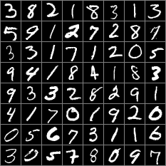</td>
    <td>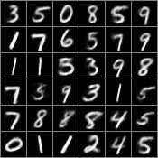</td>
  </tr>
</table>

<p>Validation data distribution for latent space, Kmeans clustered and groundtruth:</p>
<table>
  <tr>
    <th>Keans Clustered</th>
    <th>Groudtruth</th>
    <th>Centers</th>
  </tr>
  <tr>
    <td>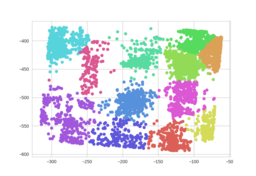</td>
    <td>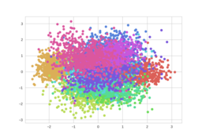</td>
    <td>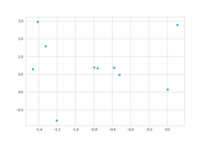</td>
  </tr>
</table>

#### cluster AE

<p>Samples for reconstruction and the reconstructed results:</p>
<table>
  <tr>
    <th>Original Samples</th>
    <th>Reconstructed Samples</th>
  </tr>
  <tr>
    <td>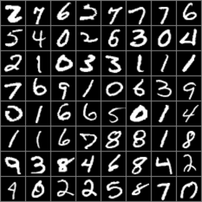</td>
    <td>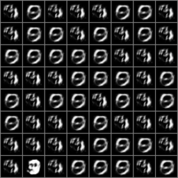</td>
  </tr>
</table>

<p>Validation data distribution for latent space, Kmeans clustered and groundtruth:</p>
<table>
  <tr>
    <th>Keans Clustered</th>
    <th>Groudtruth</th>
    <th>Centers</th>
  </tr>
  <tr>
    <td>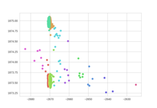</td>
    <td>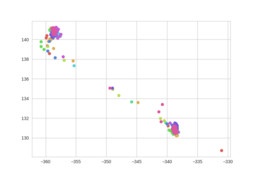</td>
    <td>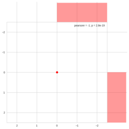</td>
  </tr>
</table>

#### VAE

<p>Samples for reconstruction and the reconstructed results:</p>
<table>
  <tr>
    <th>Original Samples</th>
    <th>Reconstructed Samples</th>
  </tr>
  <tr>
    <td></td>
    <td>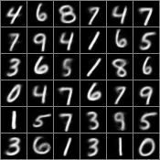</td>
  </tr>
</table>

<p>Validation data distribution for latent space, Kmeans clustered and groundtruth:</p>
<table>
  <tr>
    <th>Keans Clustered</th>
    <th>Groudtruth</th>
    <th>Centers</th>
  </tr>
  <tr>
    <td>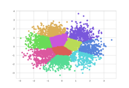</td>
    <td>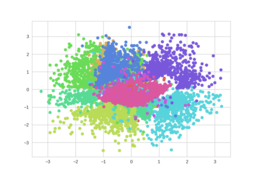</td>
    <td>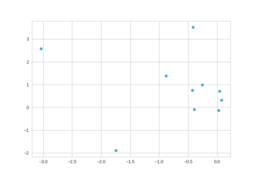</td>
  </tr>
</table>

#### cluster VAE

<p>Samples for reconstruction and the reconstructed results:</p>
<table>
  <tr>
    <th>Original Samples</th>
    <th>Reconstructed Samples</th>
  </tr>
  <tr>
    <td></td>
    <td>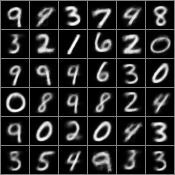</td>
  </tr>
</table>

<p>Validation data distribution for latent space, Kmeans clustered and groundtruth:</p>
<table>
  <tr>
    <th>Keans Clustered</th>
    <th>Groudtruth</th>
    <th>Centers</th>
  </tr>
  <tr>
    <td>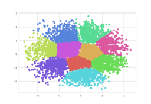</td>
    <td>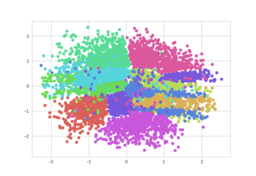</td>
    <td>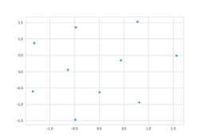</td>
  </tr>
</table>

### Sita
#### AE

<p>Samples for reconstruction and the reconstructed results:</p>
<table>
  <tr>
    <th>Original Samples</th>
    <th>Reconstructed Samples</th>
  </tr>
  <tr>
    <td>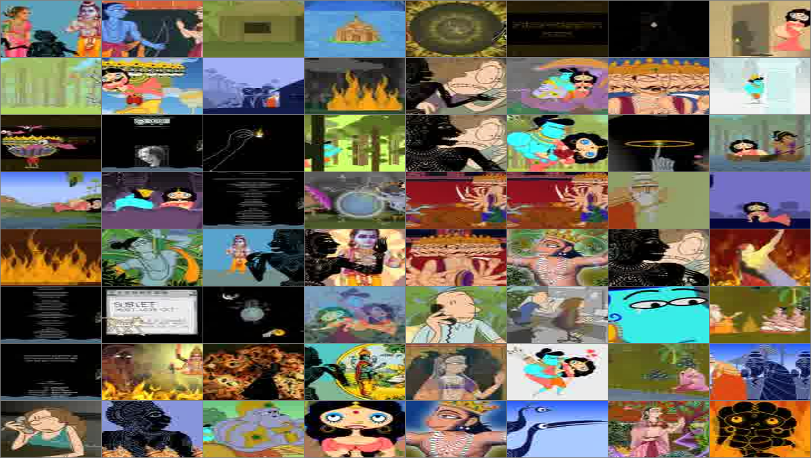</td>
    <td>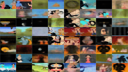</td>
  </tr>
</table>

#### cluster AE

<p>Samples for reconstruction and the reconstructed results:</p>
<table>
  <tr>
    <th>Original Samples</th>
    <th>Reconstructed Samples</th>
  </tr>
  <tr>
    <td>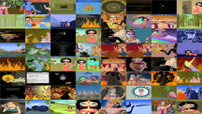</td>
    <td>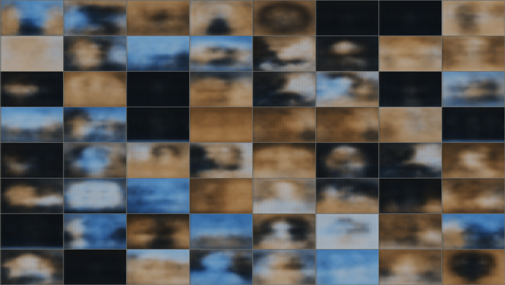</td>
  </tr>
</table>

#### VAE

<p>Samples for reconstruction and the reconstructed results:</p>
<table>
  <tr>
    <th>Original Samples</th>
    <th>Reconstructed Samples</th>
  </tr>
  <tr>
    <td></td>
    <td>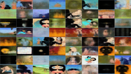</td>
  </tr>
</table>

#### cluster VAE

<p>Samples for reconstruction and the reconstructed results:</p>
<table>
  <tr>
    <th>Original Samples</th>
    <th>Reconstructed Samples</th>
  </tr>
  <tr>
    <td></td>
    <td>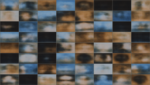</td>
  </tr>
</table>

### ShapeNet
#### AE

<p>Samples for reconstruction and the reconstructed results:</p>
<table>
  <tr>
    <th>Original Samples</th>
    <th>Reconstructed Samples</th>
  </tr>
  <tr>
    <td>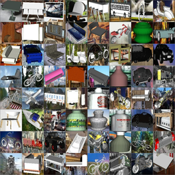</td>
    <td>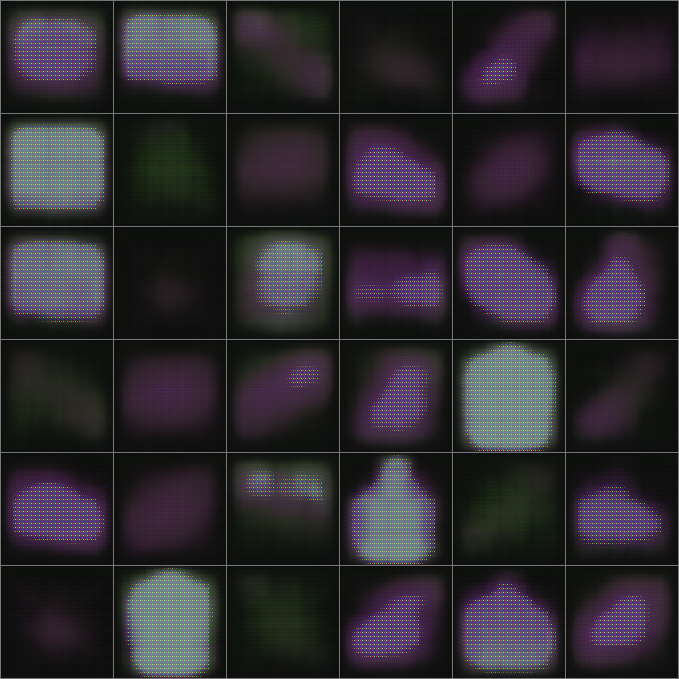</td>
  </tr>
</table>

#### cluster AE

<p>Samples for reconstruction and the reconstructed results:</p>
<table>
  <tr>
    <td>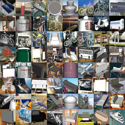</td>
    <td>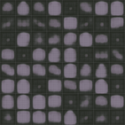</td>
  </tr>
</table>

#### VAE

<p>Samples for reconstruction and the reconstructed results:</p>
<table>
  <tr>
    <th>Original Samples</th>
    <th>Reconstructed Samples</th>
  </tr>
  <tr>
    <td></td>
    <td>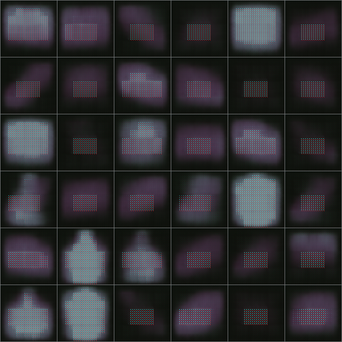</td>
  </tr>
</table>

#### cluster VAE

<p>Samples for reconstruction and the reconstructed results:</p>
<table>
  <tr>
    <th>Original Samples</th>
    <th>Reconstructed Samples</th>
  </tr>
  <tr>
    <td></td>
    <td>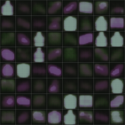</td>
  </tr>
</table>
