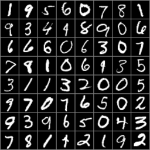
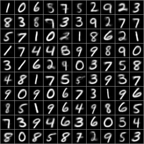
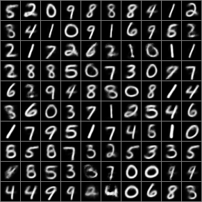
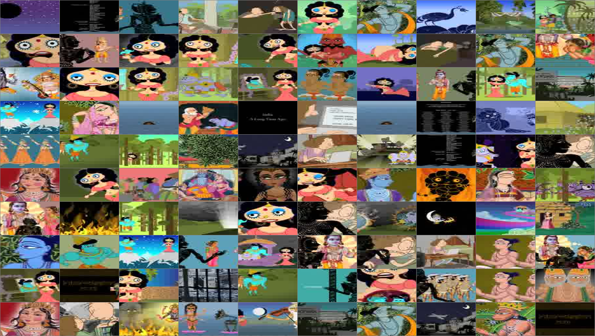
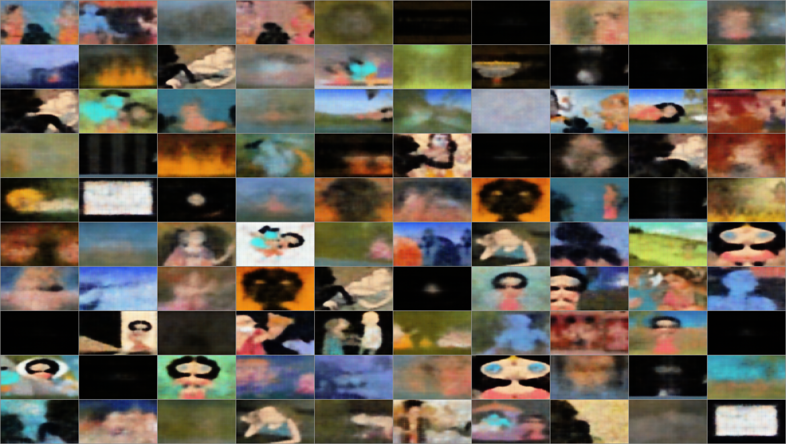
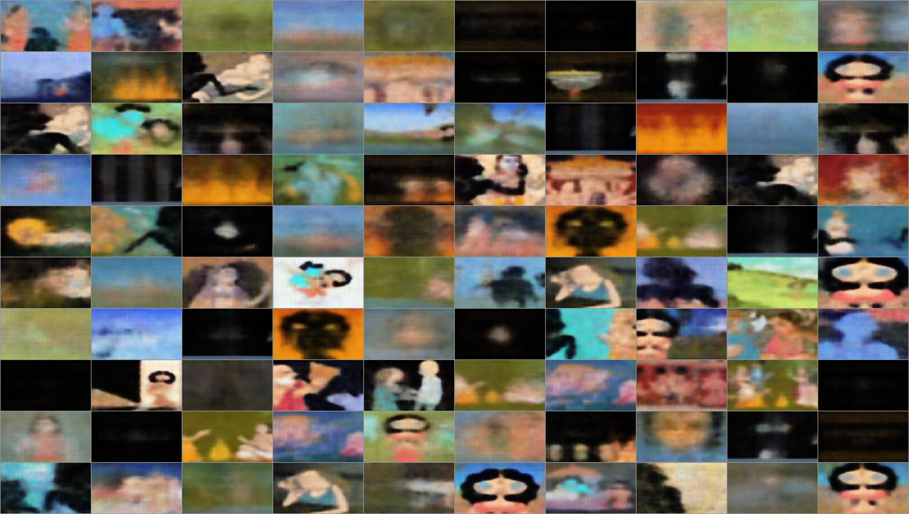
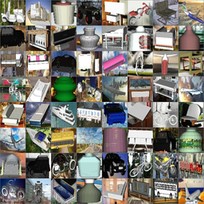
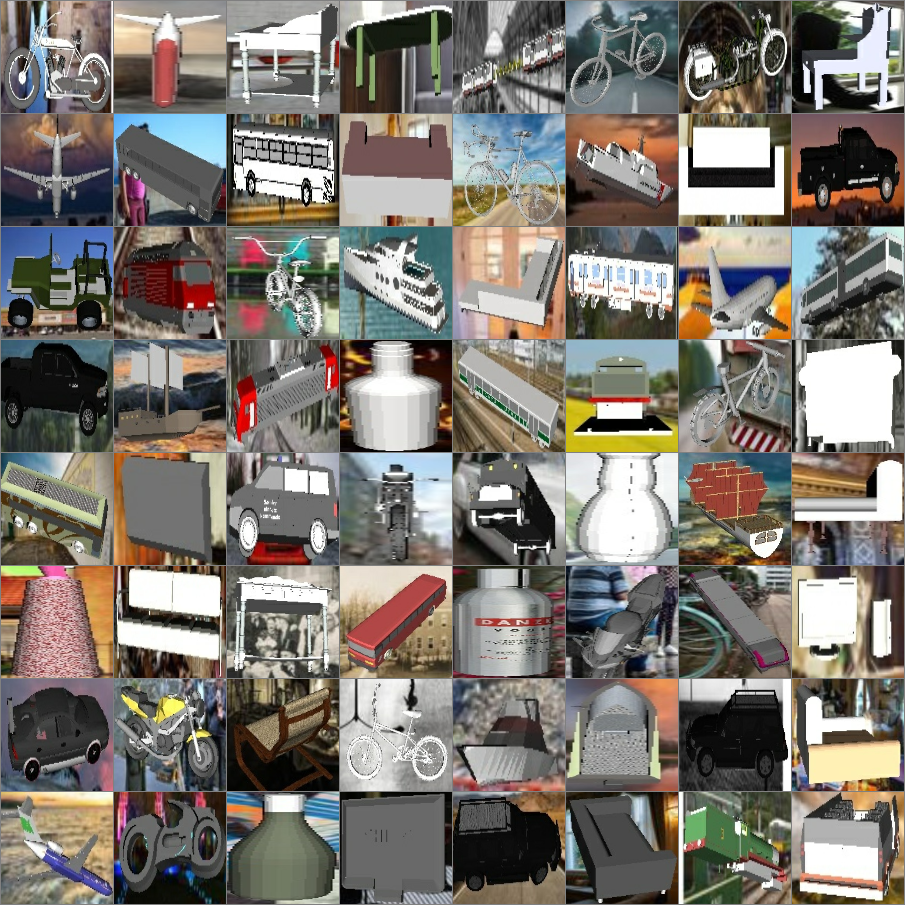

# Clustered VAE
<p class="lead">BSD 3-Clause License

Copyright (c) 2017, Yida Wang
All rights reserved.
</p>

VAE with clustered latent space designed by Yida Wang.
There is also a notebook useful for understanding the basic VAE definition based on Tensorflow through the notebook. I personably ever took a deep learning course on Kadenze CADL repo on Github.

## Clustering methods

Firstly, you should make 2 directories ```test_sita_vae``` and ```test_sita_clvae``` for saving results and figures. I use K-Means and GMM for clustering on latent space.

## Tensorflow Install

There might be several problems if there are multiple GPUs

1. cudnn problem: [cudnn](https://developer.nvidia.com/rdp/cudnn-download) for specific version. I use all compiled headers and libraries for installation according to CUDA version and platform. There is a useful discussion about [How can I install CuDNN on Ubuntu 16.04](https://askubuntu.com/questions/767269/how-can-i-install-cudnn-on-ubuntu-16-04).
It might be something like this:
```sh
cd folder/extracted/contents
sudo cp -P include/cudnn.h /usr/include
sudo cp -P lib64/libcudnn* /usr/lib/x86_64-linux-gnu/
sudo chmod a+r /usr/lib/x86_64-linux-gnu/libcudnn*
```
Those steps works on my Ubuntu 16.04 station with 4 Nvidia 1080 GPUs

2. Volatile GPU-Util problem: it might be all 0%, so you could have a try on Celeb video using them seperately by:
```sh
CUDA_VISIBLE_DEVICES=0 python3 test_sita_vae.py
```
and
```sh
CUDA_VISIBLE_DEVICES=1 python3 test_sita_clvae.py
```
or on MNIST:
```sh
CUDA_VISIBLE_DEVICES=2 python3 test_mnist_vae.py
```
and
```sh
CUDA_VISIBLE_DEVICES=3 python3 test_mnist_clvae.py
```
It will be something like this:

```sh
[detached from 10399.vae_mnist]
user@jhwl:~/Documents/yida/buildboat/cluster-vae$ nvidia-smi
Mon May 15 10:19:43 2017
+-----------------------------------------------------------------------------+
| NVIDIA-SMI 375.66                 Driver Version: 375.66                    |
|-------------------------------+----------------------+----------------------+
| GPU  Name        Persistence-M| Bus-Id        Disp.A | Volatile Uncorr. ECC |
| Fan  Temp  Perf  Pwr:Usage/Cap|         Memory-Usage | GPU-Util  Compute M. |
|===============================+======================+======================|
|   0  GeForce GTX 108...  Off  | 0000:03:00.0      On |                  N/A |
| 73%   87C    P2   216W / 250W |  10959MiB / 11170MiB |     63%      Default |
+-------------------------------+----------------------+----------------------+
|   1  GeForce GTX 108...  Off  | 0000:04:00.0     Off |                  N/A |
| 65%   85C    P2   138W / 250W |  10637MiB / 11172MiB |     82%      Default |
+-------------------------------+----------------------+----------------------+
|   2  GeForce GTX 108...  Off  | 0000:81:00.0     Off |                  N/A |
| 40%   68C    P2    63W / 250W |  10489MiB / 11172MiB |     20%      Default |
+-------------------------------+----------------------+----------------------+
|   3  GeForce GTX 108...  Off  | 0000:82:00.0     Off |                  N/A |
| 23%   38C    P8    17W / 250W |      1MiB / 11172MiB |      0%      Default |
+-------------------------------+----------------------+----------------------+

+-----------------------------------------------------------------------------+
| Processes:                                                       GPU Memory |
|  GPU       PID  Type  Process name                               Usage      |
|=============================================================================|
|    0      1563    G   /usr/lib/xorg/Xorg                             182MiB |
|    0     20836    G   compiz                                         171MiB |
|    0     21815    C   python3                                       5301MiB |
|    0     22015    C   python3                                       5301MiB |
|    1     22228    C   python3                                       5301MiB |
|    1     22405    C   python3                                       5301MiB |
|    2     25237    C   python3                                       5243MiB |
|    2     25465    C   python3                                       5243MiB |
+-----------------------------------------------------------------------------+
```

## Results

Make folders for storing result by:
```sh
./mkfolder.sh
```
### MNIST
#### VAE

<p>Samples for reconstruction and the reconstructed results:</p>
<table><tr>
<td></td>
<td></td>
</tr></table>


#### cluster VAE

<p>Samples for reconstruction and the reconstructed results:</p>
<table><tr>
<td></td>
<td></td>
</tr></table>


### Sita
#### VAE

<p>Samples for reconstruction and the reconstructed results:</p>
<table><tr>
<td></td>
<td></td>
</tr></table>

#### cluster VAE

<p>Samples for reconstruction and the reconstructed results:</p>
<table><tr>
<td></td>
<td></td>
</tr></table>

### ShapeNet
#### VAE

<p>Samples for reconstruction and the reconstructed results:</p>
<table><tr>
<td></td>
<td></td>
</tr></table>

#### cluster VAE

<p>Samples for reconstruction and the reconstructed results:</p>
<table><tr>
<td></td>
<td></td>
</tr></table>
