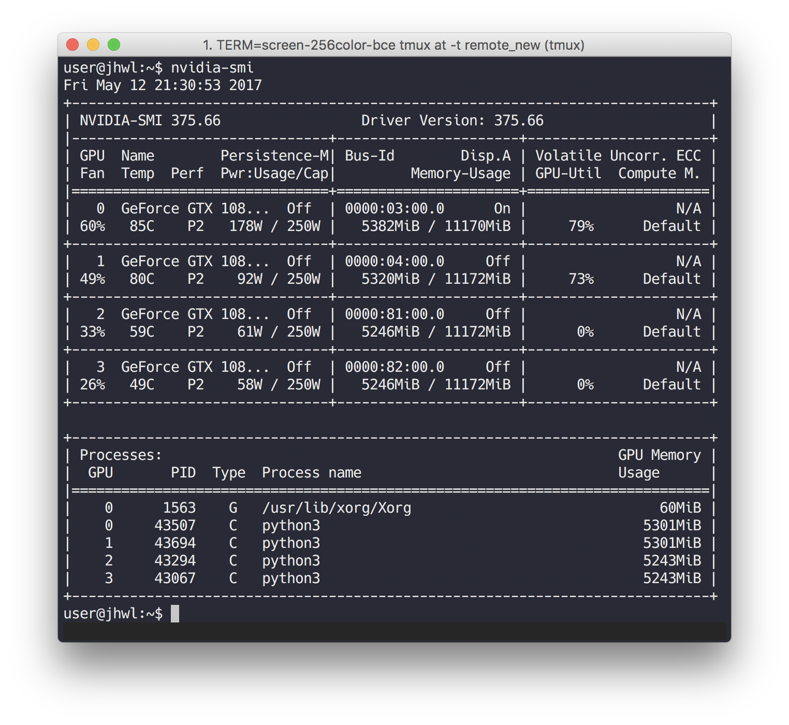
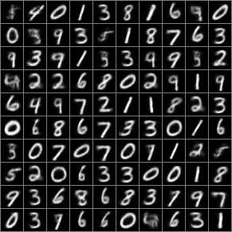
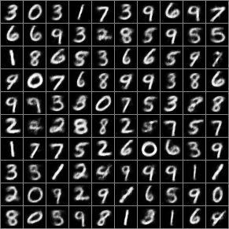
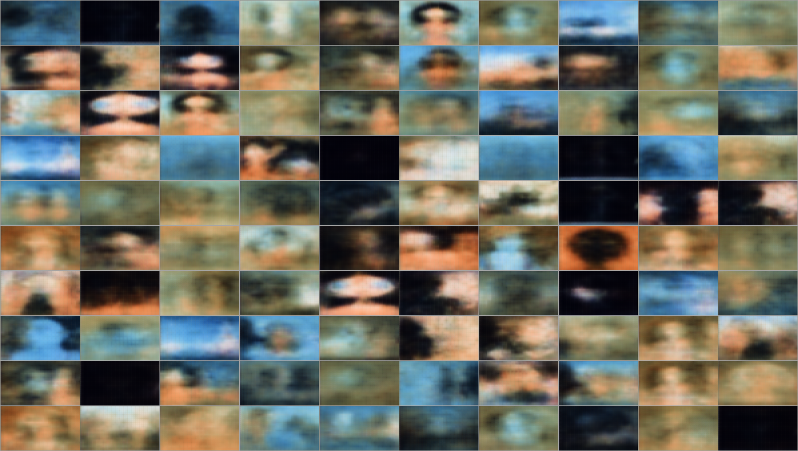
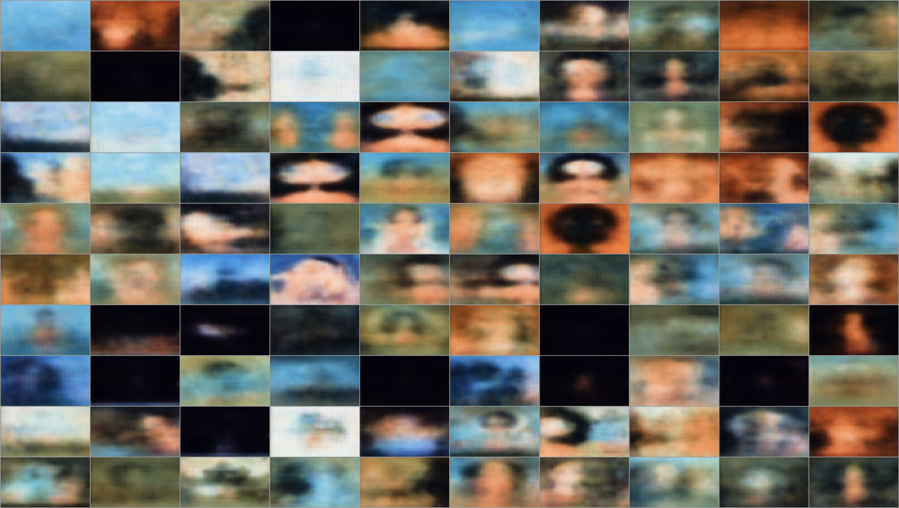

# Clustered VAE
<p class="lead">BSD 3-Clause License

Copyright (c) 2017, Yida Wang
All rights reserved.
</p>

VAE with clustered latent space designed by Yida Wang.
There is also a notebook useful for understanding the basic VAE definition based on Tensorflow through the notebook. I personably ever took a deep learning course on Kadenze CADL repo on Github.

## Clustering methods

Firstly, you should make 2 directories ```test_sita_vae``` and ```test_sita_clvae``` for saving results and figures. I use K-Means and GMM for clustering on latent space.

## Tensorflow Install

There might be several problems if there are multiple GPUs

1. cudnn problem: [cudnn](https://developer.nvidia.com/rdp/cudnn-download) for specific version. I use all compiled headers and libraries for installation according to CUDA version and platform. There is a useful discussion about [How can I install CuDNN on Ubuntu 16.04](https://askubuntu.com/questions/767269/how-can-i-install-cudnn-on-ubuntu-16-04).
It might be something like this:
```sh
cd folder/extracted/contents
sudo cp -P include/cudnn.h /usr/include
sudo cp -P lib64/libcudnn* /usr/lib/x86_64-linux-gnu/
sudo chmod a+r /usr/lib/x86_64-linux-gnu/libcudnn*
```
Those steps works on my Ubuntu 16.04 station with 4 Nvidia 1080 GPUs

2. Volatile GPU-Util problem: it might be all 0%, so you could have a try on Celeb video using them seperately by:
```sh
CUDA_VISIBLE_DEVICES=0 python3 test_sita_vae.py
```
and
```sh
CUDA_VISIBLE_DEVICES=1 python3 test_sita_clvae.py
```
or on MNIST:
```sh
CUDA_VISIBLE_DEVICES=2 python3 test_mnist_vae.py
```
and
```sh
CUDA_VISIBLE_DEVICES=3 python3 test_mnist_clvae.py
```
It will be something like this:


## Results

Make folders for storing result by:
```sh
./mkfolder.sh
```
### MNIST
#### VAE
samples for reconstruction


Initial Results


#### cluster VAE
samples for reconstruction


Initial Results


### Sita
#### VAE
samples for reconstruction


Initial Results


#### cluster VAE
samples for reconstruction


Initial Results

